# Fitness Booking Frontend

A modern and responsive web application for fitness service booking and management. Built with Next.js and React, this platform enables users to browse fitness services, manage their bookings, and allows administrators to manage services and monitor all bookings.

---

## Table of Contents

1. [Project Overview](#project-overview)
2. [Technology Stack](#technology-stack)
3. [Features](#features)
4. [System Requirements](#system-requirements)
5. [Installation Guide](#installation-guide)
6. [Running the Application](#running-the-application)
7. [Project Structure](#project-structure)
8. [Key Features Documentation](#key-features-documentation)
9. [API Integration](#api-integration)
10. [Development Guidelines](#development-guidelines)

---

## Project Overview

Fitness Booking Frontend is a comprehensive platform that serves two primary user types:

- **End Users**: Browse available fitness services, register, book services, and manage their bookings
- **Administrators**: Manage fitness services (create, edit, delete) and oversee all user bookings

The application features a modern dark theme with responsive design, ensuring optimal user experience across desktop and mobile devices.

---

## Technology Stack

| Technology | Version | Purpose |
|-----------|---------|---------|
| Next.js | 16.2.6 | React framework for SSR and static generation |
| React | 19.2.4 | UI library for building components |
| Tailwind CSS | 4 | Utility-first CSS framework |
| Axios | 1.16.0 | HTTP client for API communication |
| React Hot Toast | 2.6.0 | Toast notifications |
| ESLint | 9 | Code quality and linting |

---

## System Requirements

- **Node.js**: 20 or later
- **npm**: 10 or later
- **Operating System**: Windows, macOS, or Linux
- **Browser**: Chrome, Firefox, Safari, or Edge (latest versions recommended)

---

## Installation Guide

### Step 1: Clone or Navigate to Project Directory

```bash
cd fitness-booking-frontend
```

### Step 2: Install Dependencies

```bash
npm install
```

This command will install all required packages listed in `package.json`.

---

## Running the Application

### Development Mode

Start the development server with hot reload enabled:

```bash
npm run dev
```

The application will be available at `http://localhost:3000`

### Production Build

Create an optimized production build:

```bash
npm run build
```

### Production Server

Run the application in production mode:

```bash
npm start
```

### Code Quality Check

Run ESLint to check for code quality issues:

```bash
npm run lint
```

---

## Project Structure

```
fitness-booking-frontend/
├── public/                      # Static assets
│   └── images/                  # Image files
├── src/
│   ├── app/                     # Next.js app directory
│   │   ├── admin/               # Admin pages
│   │   │   ├── bookings/        # Admin booking management
│   │   │   └── services/        # Admin service management
│   │   │       ├── create/      # Create new service
│   │   │       └── edit/        # Edit existing service
│   │   ├── bookings/            # User booking page
│   │   ├── login/               # Login page
│   │   ├── register/            # Registration page
│   │   ├── services/            # User services listing
│   │   │   └── [id]/            # Service detail page
│   │   ├── hooks/               # Custom React hooks
│   │   ├── utils/               # Utility functions
│   │   ├── layout.js            # Root layout
│   │   ├── page.js              # Landing page
│   │   └── globals.css          # Global styles
│   ├── components/              # Reusable UI components
│   │   ├── adminBookingCard.jsx
│   │   ├── Footer.jsx
│   │   ├── navbar.jsx
│   │   ├── scheduleCard.jsx
│   │   ├── Skeleton.jsx
│   │   └── UserBookingCard.jsx
│   └── lib/                     # Shared libraries
│       └── axios.js             # Axios HTTP client setup
├── eslint.config.mjs            # ESLint configuration
├── jsconfig.json                # JavaScript configuration
├── next.config.mjs              # Next.js configuration
├── package.json                 # Project dependencies
├── postcss.config.mjs           # PostCSS configuration
└── README.md                    # This file
```

---

## Key Features Documentation

### 1. User Features

#### A. Landing Page

**Location**: `/` (root path)

**Description**: Welcome page displaying the application overview and hero section.

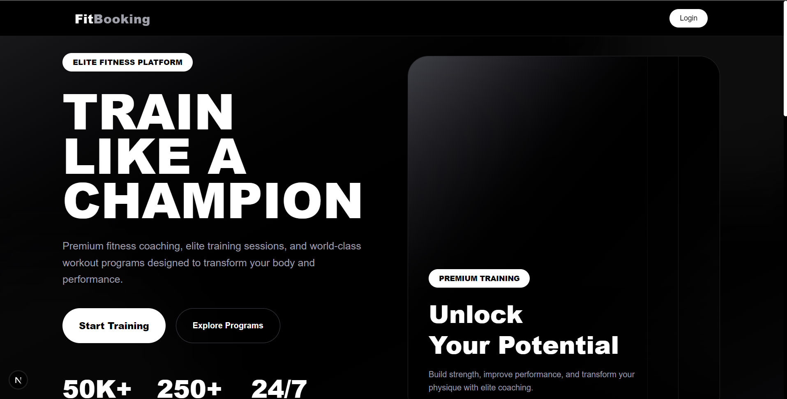
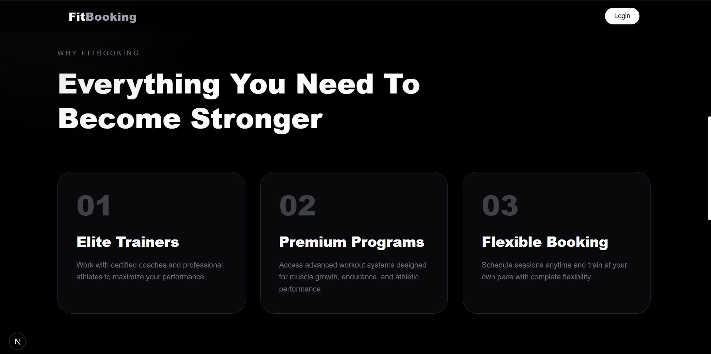
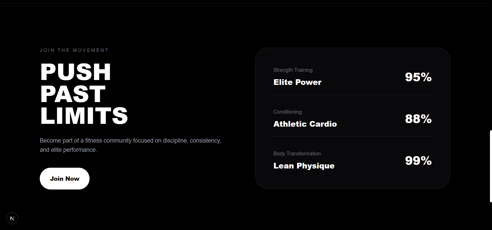
- Add a screenshot of the landing page featuring the hero section with gradient background and main call-to-action buttons

**Key Elements**:
- Hero section with gradient background design
- Navigation to services and booking areas
- Responsive layout optimized for all screen sizes
- Call-to-action buttons for user engagement

---

#### B. User Registration

**Location**: `/register`

**Description**: User account creation page.

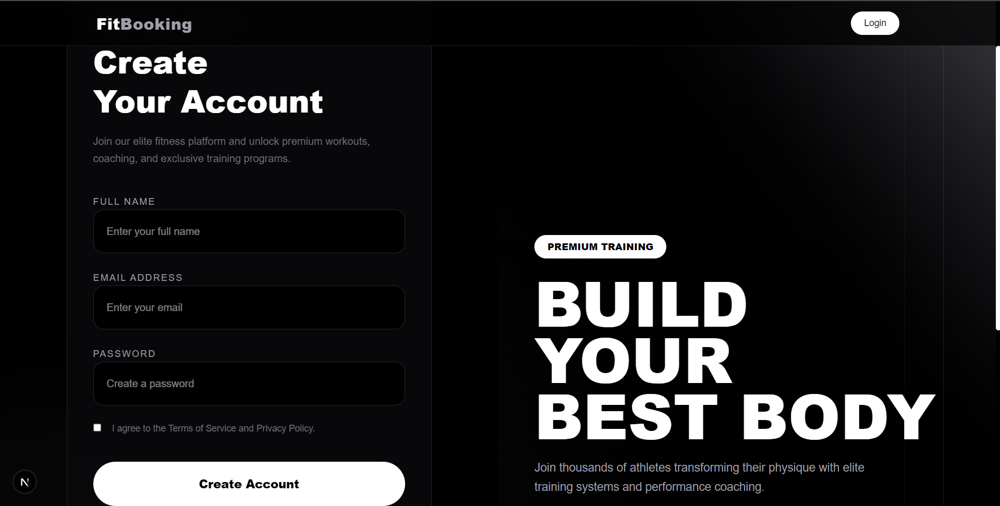
- Add a screenshot of the registration form showing email, password input fields and submit button

**Features**:
- Email and password input fields
- Form validation before submission
- Error message display for validation failures
- Automatic redirect to login after successful registration
- Responsive form layout

---

#### C. User Login

**Location**: `/login`

**Description**: User authentication page.

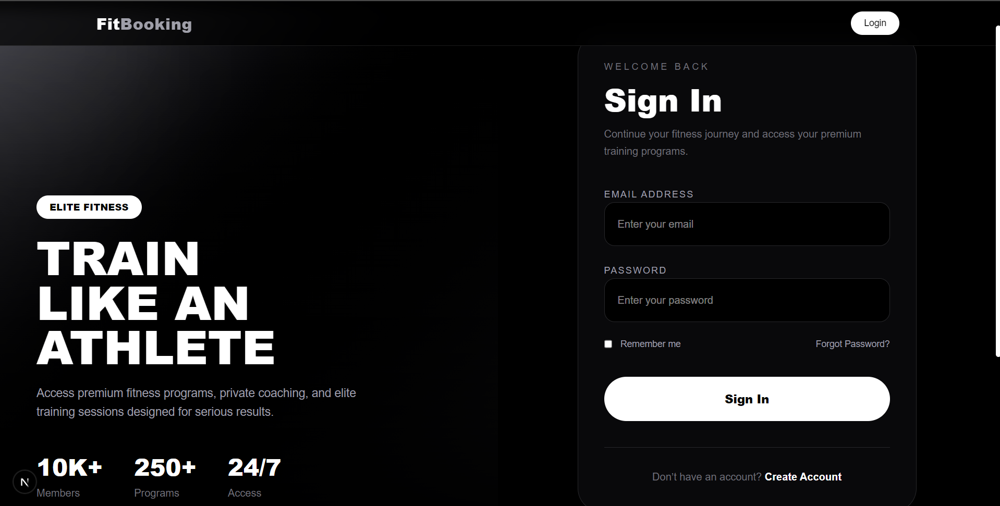
- Add a screenshot of the login form with email and password fields and login button

**Features**:
- Email and password authentication
- Secure session token management
- Automatic redirect to dashboard after successful login
- Clear error messages for authentication failures
- Remember functionality option

---

#### D. Services Listing

**Location**: `/services`

**Description**: Browse all available fitness services.

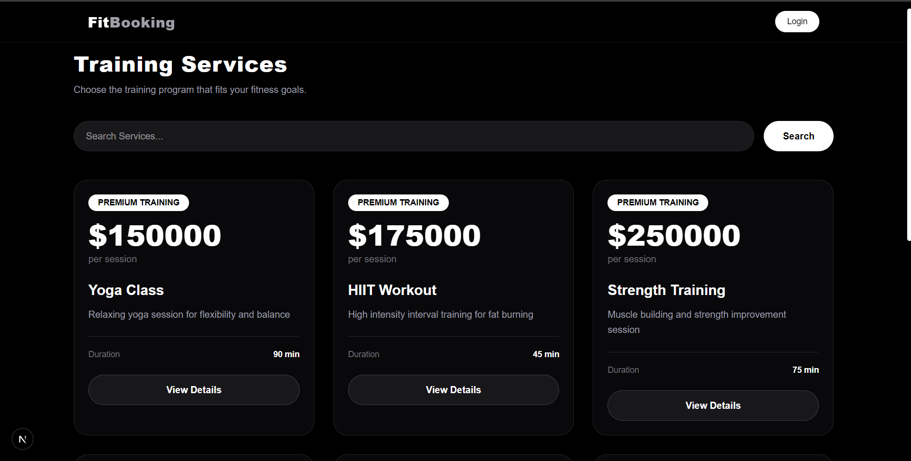
- Add a screenshot showing a responsive grid of service cards displaying service names, descriptions, and schedules

**Features**:
- Display all available fitness services in card format
- Service information including name, description, and schedule
- Filter and search capabilities
- Click to view detailed service information
- Responsive grid layout for desktop and mobile

---

#### E. Service Details

**Location**: `/services/[id]`

**Description**: Detailed view of a specific fitness service.

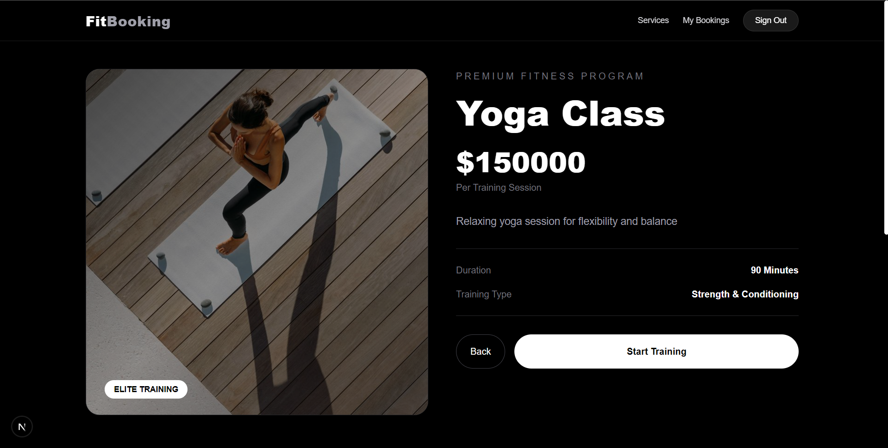
- Add a screenshot of the service detail page showing complete service information with booking button

**Features**:
- Complete service information display
- Detailed schedule and availability information
- Booking button (requires user authentication)
- Related services recommendations
- Trainer/instructor information if available

---

#### F. User Bookings Management

**Location**: `/bookings`

**Description**: View and manage all user bookings.

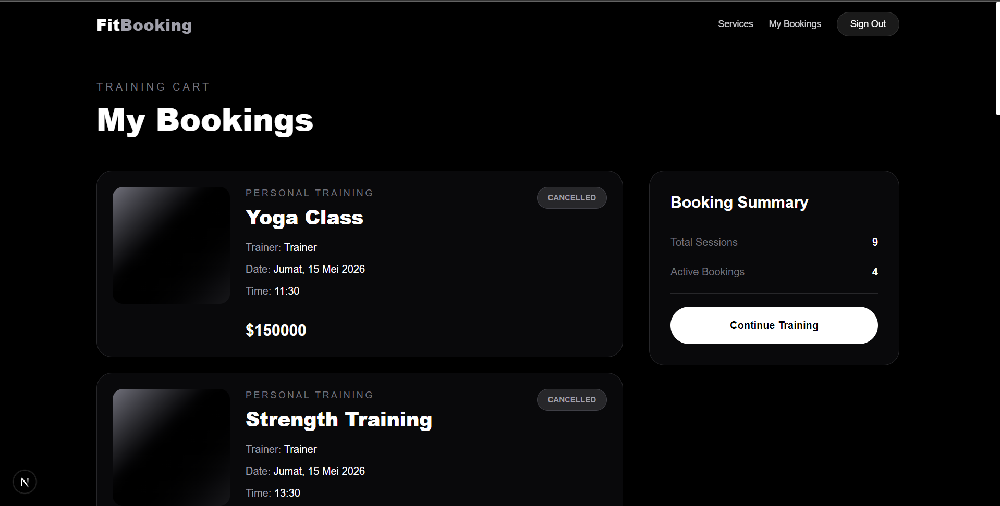
- Add a screenshot showing the bookings list with booking cards displaying status, schedule, and action buttons

**Features**:
- Display all user bookings in organized cards
- Show booking status (confirmed, pending, completed, cancelled)
- Display schedule details for each booking
- Cancel booking functionality
- View booking history
- Skeleton loading state for improved user experience

---

### 2. Admin Features

#### A. Admin Dashboard Navigation

**Location**: `/admin/*`

**Description**: Restricted area accessible only to administrator accounts.

**Access Control**: 
- Protected routes requiring admin authentication
- Automatic redirection for unauthorized access
- Role-based access control implementation

---

#### B. Services Management

**Location**: `/admin/services`

**Description**: Complete service management interface for administrators.

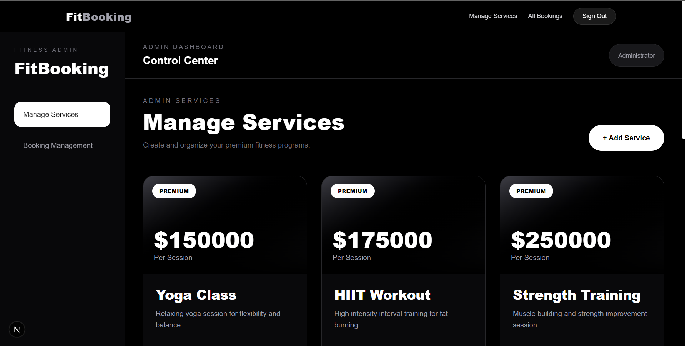
- Add a screenshot showing the services list with action buttons for edit, delete, and create new service

**Features**:
- View all services in an organized list format
- Edit existing service details
- Create new fitness services
- Delete services with confirmation
- Real-time updates to service list
- Search and filter services

##### B.1 Create New Service

**Location**: `/admin/services/create`

**Description**: Form to create a new fitness service.

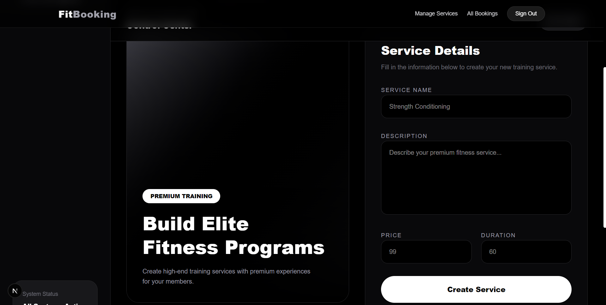
- Add a screenshot of the service creation form with all required input fields and submit button

**Form Fields**:
- Service name
- Service description
- Schedule and timing details
- Pricing information
- Availability status
- Additional service details

**Actions**:
- Submit form to create service
- Input validation before submission
- Success confirmation message
- Auto redirect to services list

---

##### B.2 Edit Service

**Location**: `/admin/services/edit/[id]`

**Description**: Form to edit existing fitness service details.

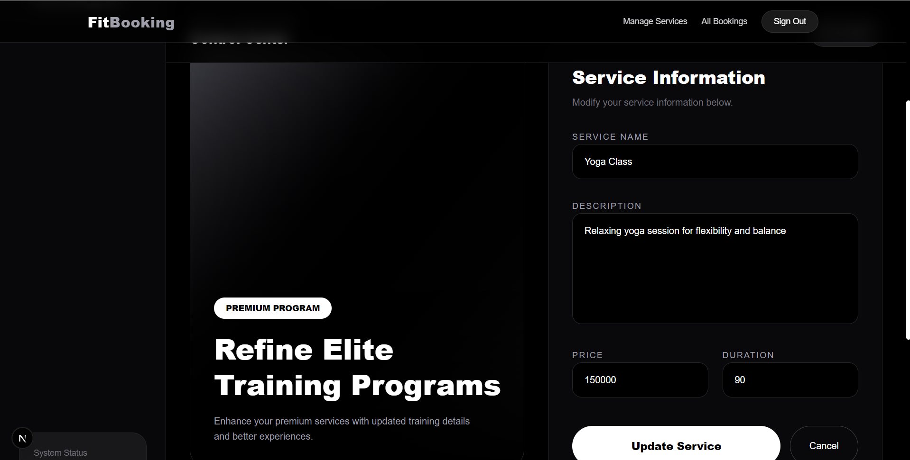
- Add a screenshot of the edit form pre-populated with existing service information

**Features**:
- Pre-populate form with current service data
- Update any service information fields
- Input validation before submission
- Success/error notifications
- Changes saved to database immediately
- Option to cancel without saving

---

#### C. Admin Bookings Management

**Location**: `/admin/bookings`

**Description**: Monitor and manage all user bookings across the platform.

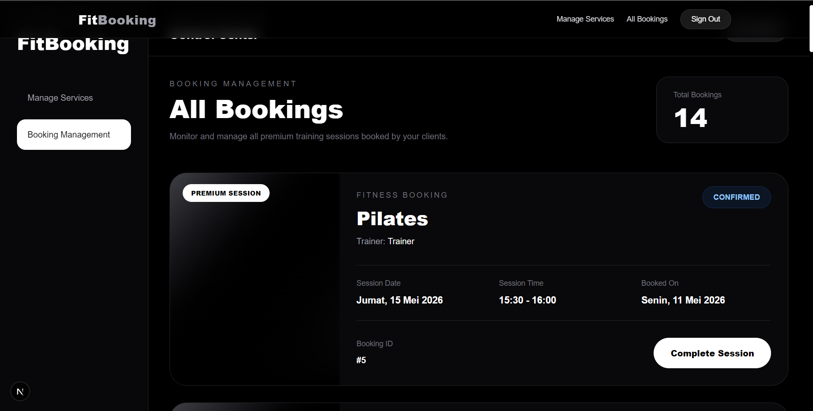
- Add a screenshot showing the complete list of all user bookings with admin action buttons

**Features**:
- View all bookings from all users
- Filter bookings by status (confirmed, pending, completed, cancelled)
- Search bookings by user name or service
- View detailed booking information
- Update booking status if required
- Approve or reject bookings
- View user contact information
- Admin booking cards with comprehensive details

---

## API Integration

The frontend communicates with a backend API for all data operations. The HTTP client is configured in `src/lib/axios.js`.

### API Endpoints Reference

| Endpoint | Method | Purpose | Auth Required |
|----------|--------|---------|---|
| `/auth/register` | POST | Create new user account | No |
| `/auth/login` | POST | Authenticate user | No |
| `/services` | GET | Fetch all available services | No |
| `/services/:id` | GET | Fetch specific service details | No |
| `/bookings/my-bookings` | GET | Fetch user's bookings | Yes |
| `/bookings/create` | POST | Create new booking | Yes |
| `/bookings/:id/cancel` | DELETE | Cancel user booking | Yes |
| `/admin/services` | GET | Fetch all services (admin) | Yes (Admin) |
| `/admin/services/create` | POST | Create new service | Yes (Admin) |
| `/admin/services/:id/update` | PUT | Update service details | Yes (Admin) |
| `/admin/services/:id/delete` | DELETE | Remove service | Yes (Admin) |
| `/bookings/admin/all` | GET | Fetch all user bookings | Yes (Admin) |

### Authentication Mechanism

- Authentication uses JWT (JSON Web Tokens)
- Tokens are stored in browser localStorage
- Axios instance automatically includes token in request headers
- Protected routes check token validity before access

---

## Reusable Components

| Component | Purpose | File Location |
|-----------|---------|-----------|
| `Navbar` | Application navigation header | `src/components/navbar.jsx` |
| `Footer` | Application footer section | `src/components/Footer.jsx` |
| `UserBookingCard` | Display individual user booking | `src/components/UserBookingCard.jsx` |
| `AdminBookingCard` | Display booking in admin interface | `src/components/adminBookingCard.jsx` |
| `ScheduleCard` | Display schedule information | `src/components/scheduleCard.jsx` |
| `Skeleton` | Loading state placeholder | `src/components/Skeleton.jsx` |

### Custom Hooks

| Hook | Purpose | File Location |
|------|---------|-----------|
| `useProtected` | Protect routes based on user role | `src/app/hooks/useProtected.js` |

### Utility Functions

| Function | Purpose | File Location |
|----------|---------|-----------|
| `formatDate` | Convert date to readable format | `src/app/utils/formatDate.js` |
| `formatTime` | Convert time to readable format | `src/app/utils/formatTime.js` |

---

## Development Guidelines

### Code Standards and Conventions

1. **Component Naming**: Use PascalCase for component files (e.g., `UserBookingCard.jsx`)
2. **File Organization**: Group related components in subdirectories
3. **Utility Functions**: Use camelCase for file names (e.g., `formatDate.js`)
4. **Styling Approach**: Use Tailwind CSS utility classes exclusively
5. **API Calls**: Use the configured Axios instance from `src/lib/axios.js`
6. **Comment Style**: Use clear, concise comments for complex logic

### Component Development Best Practices

- Build all new components as functional components with React hooks
- Implement comprehensive error handling and loading states
- Use Skeleton components for improved loading state UX
- Display meaningful, user-friendly error messages
- Keep components focused on single responsibility
- Use composition for complex UI structures

### State Management Approach

- Use React `useState` hook for local component state
- Use `useEffect` hook for side effects and data fetching
- Implement Context API for shared state across components
- Avoid prop drilling for deeply nested components

### Error Handling Requirements

- Catch and log all API errors appropriately
- Display user-friendly error messages in UI
- Show toast notifications for critical errors
- Implement retry mechanisms for failed requests
- Log errors to browser console for debugging

### Testing Recommendations

- Write unit tests for utility functions
- Write component tests for key interactive components
- Test API integration scenarios thoroughly
- Test protected routes and role-based access control
- Test form validation and submission flows

### Deployment Considerations

- Ensure all environment variables are properly configured
- Verify backend API endpoint is correct and accessible
- Optimize images and static assets
- Enable appropriate caching strategies
- Use production build (`npm run build`) for deployment
- Test application in production build before deploying

---

## Troubleshooting Guide

### Common Issues and Solutions

**Issue**: Application fails to start

**Solution**: 
- Verify Node.js version is 20 or later
- Run `npm install` to ensure all dependencies are installed
- Clear node_modules and package-lock.json, then reinstall
- Check for any error messages in console

---

**Issue**: API connection errors or 404 responses

**Solution**:
- Verify backend API server is running
- Check API endpoint configuration in `src/lib/axios.js`
- Verify network connectivity
- Check browser network tab for request/response details
- Ensure CORS is properly configured on backend

---

**Issue**: Protected routes redirecting unexpectedly

**Solution**:
- Verify user authentication token is stored correctly
- Check that user role is properly assigned
- Clear browser storage and login again
- Verify `useProtected` hook implementation

---

**Issue**: Styling not applied or appearing incorrectly

**Solution**:
- Run `npm run build` to rebuild Tailwind CSS
- Clear browser cache (Ctrl+Shift+Delete)
- Check browser console for CSS loading errors
- Verify Tailwind CSS configuration in `tailwind.config.js`

---

**Issue**: Slow loading or performance issues

**Solution**:
- Check network tab for large asset sizes
- Optimize images in public/images directory
- Enable Next.js image optimization
- Review browser DevTools Performance tab
- Check for memory leaks in components

---

## Additional Resources

For more information about the technologies and frameworks used in this project:

- [Next.js Official Documentation](https://nextjs.org/docs)
- [React Official Documentation](https://react.dev)
- [Tailwind CSS Documentation](https://tailwindcss.com/docs)
- [Axios HTTP Client Documentation](https://axios-http.com/docs/intro)
- [JavaScript ES6+ Guide](https://developer.mozilla.org/en-US/docs/Web/JavaScript)

---

## Project Information

- **Version**: 0.1.0
- **Framework**: Next.js 16
- **UI Library**: React 19
- **Styling**: Tailwind CSS 4
- **State Management**: React Hooks
- **Last Updated**: May 2026

---

**Note**: This frontend application is designed to work with a dedicated backend API. Ensure the backend server is running and properly configured before deploying this frontend application to a production environment.
